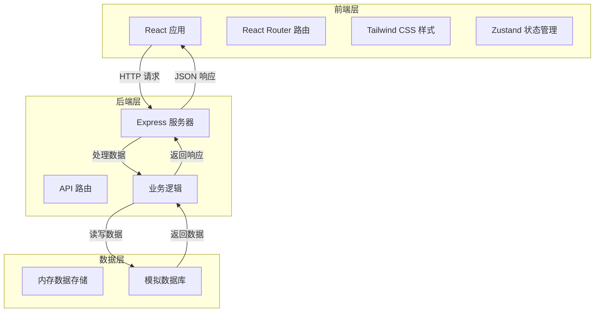
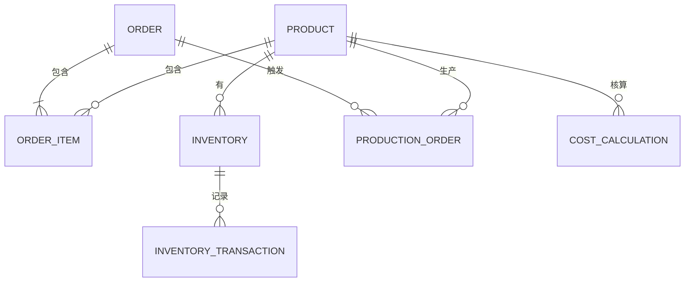

## 1. 架构设计
本系统采用前后端分离架构，前端使用 React 提供交互界面，后端使用 Express 提供 API 服务，数据存储使用内存数据库（演示用途）。



## 2. 技术描述
- 前端：React@18 + TypeScript + Tailwind CSS@3 + Vite
- 初始化工具：vite-init
- 后端：Express@4 + TypeScript
- 数据库：内存存储（演示版本）
- 状态管理：Zustand
- 图标库：Lucide React
- 图表库：Recharts

## 3. 路由定义
| 路由 | 用途 |
|------|------|
| / | 首页仪表盘 |
| /products | 产品管理 |
| /orders | 订单管理 |
| /production | 生产管理 |
| /inventory | 仓库管理 |
| /finance | 财务管理 |
| /costing | 成本核算 |

## 4. API 定义
### 产品 API
```typescript
interface Product {
  id: string;
  name: string;
  category: string;
  description: string;
  price: number;
  specifications: Record<string, string>;
  createdAt: string;
  updatedAt: string;
}

// GET /api/products - 获取产品列表
// POST /api/products - 创建产品
// GET /api/products/:id - 获取产品详情
// PUT /api/products/:id - 更新产品
// DELETE /api/products/:id - 删除产品
```

### 订单 API
```typescript
interface Order {
  id: string;
  orderNumber: string;
  customer: {
    name: string;
    contact: string;
    address: string;
  };
  items: Array<{
    productId: string;
    productName: string;
    quantity: number;
    price: number;
  }>;
  totalAmount: number;
  status: 'pending' | 'confirmed' | 'in_production' | 'ready' | 'shipped' | 'completed' | 'cancelled';
  createdAt: string;
  updatedAt: string;
}

// GET /api/orders - 获取订单列表
// POST /api/orders - 创建订单
// GET /api/orders/:id - 获取订单详情
// PUT /api/orders/:id - 更新订单
// PATCH /api/orders/:id/status - 更新订单状态
```

### 生产 API
```typescript
interface ProductionOrder {
  id: string;
  orderId?: string;
  productId: string;
  productName: string;
  quantity: number;
  status: 'planned' | 'in_progress' | 'completed' | 'paused';
  progress: number;
  startDate?: string;
  endDate?: string;
  notes?: string;
  createdAt: string;
  updatedAt: string;
}

// GET /api/production - 获取生产工单列表
// POST /api/production - 创建生产工单
// GET /api/production/:id - 获取生产工单详情
// PUT /api/production/:id - 更新生产工单
// PATCH /api/production/:id/progress - 更新生产进度
```

### 库存 API
```typescript
interface InventoryItem {
  id: string;
  productId: string;
  productName: string;
  quantity: number;
  minStock: number;
  location: string;
  lastUpdated: string;
}

interface InventoryTransaction {
  id: string;
  productId: string;
  type: 'in' | 'out';
  quantity: number;
  referenceId?: string;
  notes?: string;
  createdAt: string;
}

// GET /api/inventory - 获取库存列表
// POST /api/inventory/inbound - 入库
// POST /api/inventory/outbound - 出库
// GET /api/inventory/transactions - 获取库存流水
```

### 财务 API
```typescript
interface FinancialRecord {
  id: string;
  type: 'income' | 'expense';
  category: string;
  amount: number;
  description: string;
  referenceId?: string;
  date: string;
  createdAt: string;
}

// GET /api/finance/records - 获取财务记录
// POST /api/finance/records - 创建财务记录
// GET /api/finance/summary - 获取财务汇总
```

### 成本核算 API
```typescript
interface CostCalculation {
  id: string;
  productId: string;
  productName: string;
  materialCost: number;
  laborCost: number;
  overheadCost: number;
  totalCost: number;
  calculationDate: string;
  notes?: string;
}

// GET /api/costing - 获取成本核算列表
// POST /api/costing/calculate - 计算产品成本
// GET /api/costing/:productId - 获取产品成本详情
```

## 5. 数据模型
### 5.1 数据模型关系图


### 5.2 数据结构（内存存储）
系统使用 TypeScript 接口定义数据结构，数据存储在内存中（演示版本）。

```typescript
// 产品数据结构
interface Product {
  id: string;
  name: string;
  category: string;
  description: string;
  price: number;
  specifications: Record<string, string>;
  createdAt: Date;
  updatedAt: Date;
}

// 订单数据结构
interface Order {
  id: string;
  orderNumber: string;
  customer: {
    name: string;
    contact: string;
    address: string;
  };
  items: Array<{
    productId: string;
    productName: string;
    quantity: number;
    price: number;
  }>;
  totalAmount: number;
  status: 'pending' | 'confirmed' | 'in_production' | 'ready' | 'shipped' | 'completed' | 'cancelled';
  createdAt: Date;
  updatedAt: Date;
}

// 生产工单数据结构
interface ProductionOrder {
  id: string;
  orderId?: string;
  productId: string;
  productName: string;
  quantity: number;
  status: 'planned' | 'in_progress' | 'completed' | 'paused';
  progress: number;
  startDate?: Date;
  endDate?: Date;
  notes?: string;
  createdAt: Date;
  updatedAt: Date;
}

// 库存数据结构
interface InventoryItem {
  id: string;
  productId: string;
  productName: string;
  quantity: number;
  minStock: number;
  location: string;
  lastUpdated: Date;
}

// 财务记录数据结构
interface FinancialRecord {
  id: string;
  type: 'income' | 'expense';
  category: string;
  amount: number;
  description: string;
  referenceId?: string;
  date: Date;
  createdAt: Date;
}

// 成本核算数据结构
interface CostCalculation {
  id: string;
  productId: string;
  productName: string;
  materialCost: number;
  laborCost: number;
  overheadCost: number;
  totalCost: number;
  calculationDate: Date;
  notes?: string;
}
```

## 6. 项目结构
```
/workspace
├── .trae/
│   └── documents/
│       ├── prd.md
│       └── arch.md
├── src/
│   ├── components/
│   ├── pages/
│   ├── hooks/
│   ├── store/
│   ├── types/
│   ├── utils/
│   ├── App.tsx
│   └── main.tsx
├── api/
│   ├── routes/
│   ├── data/
│   ├── types/
│   └── index.ts
├── package.json
├── vite.config.ts
├── tailwind.config.js
└── tsconfig.json
```
