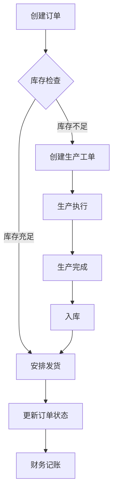

## 1. 产品概述
本系统是为玻璃钢模特道具销售企业打造的企业采购 ERP 系统，旨在解决销售、生产、仓库、财务、产品管理及成本核算等核心业务流程的数字化管理问题。
- 主要服务于玻璃钢模特道具制造企业的销售、生产、仓储和财务部门管理人员
- 提升业务流程效率，实现数据集成管理，精确核算生产成本

## 2. 核心功能

### 2.1 用户角色
| 角色 | 注册方式 | 核心权限 |
|------|---------|---------|
| 系统管理员 | 默认账号 | 全部功能访问、用户管理 |
| 销售管理员 | 管理员创建 | 订单管理、产品管理 |
| 生产管理员 | 管理员创建 | 生产管理、成本核算 |
| 仓库管理员 | 管理员创建 | 仓库管理 |
| 财务管理员 | 管理员创建 | 财务管理 |

### 2.2 功能模块
1. **产品管理系统**: 产品分类、产品信息维护、规格参数管理、价格管理
2. **订单管理系统**: 订单录入、订单跟踪、订单状态管理
3. **生产管理系统**: 生产计划、生产工单、生产进度跟踪
4. **仓库管理系统**: 入库管理、出库管理、库存盘点
5. **财务管理系统**: 收入记录、支出记录、财务报表
6. **成本核算系统**: 材料成本、人工成本、制造费用、成本分析

### 2.3 页面详情
| 页面名称 | 模块名称 | 功能描述 |
|---------|---------|---------|
| 首页 | 仪表盘 | 展示关键业务指标、近期订单、生产进度、库存预警 |
| 产品管理 | 产品列表 | 展示所有产品，支持搜索、筛选、新增、编辑、删除 |
| 产品管理 | 产品详情 | 查看和编辑产品的详细信息、规格、价格 |
| 订单管理 | 订单列表 | 展示所有订单，支持状态筛选、新增、编辑、查看详情 |
| 订单管理 | 订单详情 | 查看订单详细信息、订单状态历史、发货信息 |
| 生产管理 | 生产任务 | 展示生产工单，支持状态管理、进度更新 |
| 生产管理 | 生产计划 | 制定和管理生产计划，关联订单和产品 |
| 仓库管理 | 库存管理 | 展示库存信息，支持入库、出库、盘点操作 |
| 财务管理 | 财务流水 | 展示收入和支出记录，支持筛选和统计 |
| 成本核算 | 成本计算 | 计算产品生产成本，支持成本分析和报表导出 |

## 3. 核心流程

### 3.1 销售-生产-发货流程
1. 销售管理员创建订单，录入产品和客户信息
2. 系统自动检查库存，库存不足时触发生产流程
3. 生产管理员创建生产工单，安排生产计划
4. 生产过程中更新生产进度
5. 生产完成后通知仓库入库
6. 仓库管理员完成入库操作
7. 订单管理确认发货，更新订单状态
8. 财务系统记录收入和成本

## 4. 用户界面设计

### 4.1 设计风格
- 主色调：工业蓝 (#2563eb)，代表专业、可靠
- 辅助色：琥珀橙 (#f59e0b)，用于强调和警告
- 按钮风格：圆角矩形，带有轻微阴影，悬停时有颜色渐变
- 字体：Inter 无衬线字体，标题使用加粗处理
- 布局风格：侧边栏导航 + 卡片式内容区
- 图标风格：使用 Lucide 线性图标，简洁现代

### 4.2 页面设计概览
| 页面名称 | 模块名称 | UI 元素 |
|---------|---------|---------|
| 首页 | 仪表盘 | 统计卡片网格、图表区域、近期活动列表 |
| 产品管理 | 产品列表 | 表格布局、筛选栏、操作按钮组 |
| 订单管理 | 订单列表 | 卡片或表格视图、状态标签、快速操作 |
| 生产管理 | 生产任务 | 进度条、时间线、状态更新面板 |
| 仓库管理 | 库存管理 | 库存卡片、入库/出库表单、库存预警提示 |
| 财务管理 | 财务流水 | 折线图、饼图、数据表格 |
| 成本核算 | 成本计算 | 表单布局、成本对比图表、导出功能 |

### 4.3 响应式设计
- 桌面端优先，适配平板和移动设备
- 侧边栏在小屏幕上可折叠为图标导航
- 表格在小屏幕上可横向滚动或转为卡片视图

### 4.4 交互动效
- 页面加载时的骨架屏动画
- 按钮悬停和点击的微交互
- 数据更新时的平滑过渡
- 模态框打开/关闭的缩放动画
